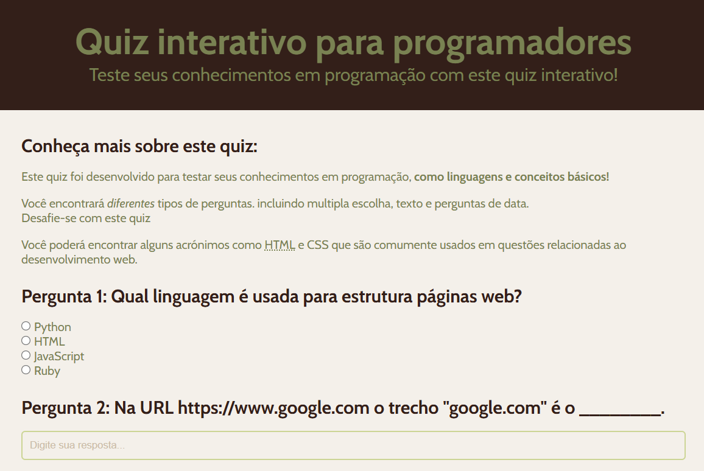
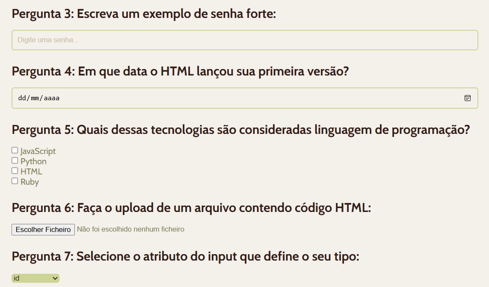
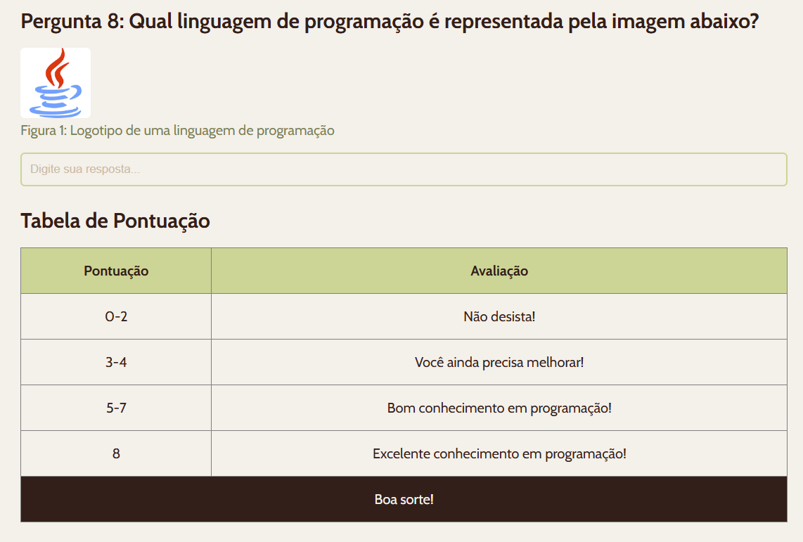
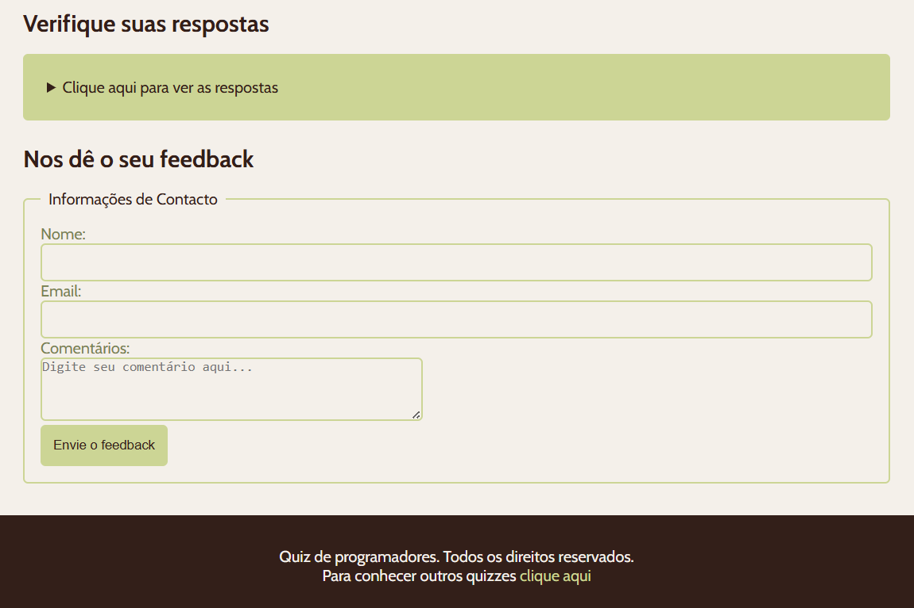

# Projeto-HTML-CSS-JavaScript
Este é um projeto de um Quiz Interativo desenvolvido para testar conhecimentos técnicos em programação e desenvolvimento web. O projeto foi construído focado em semântica HTML, estilização moderna com CSS e manipulação básica de dados com JavaScript.

